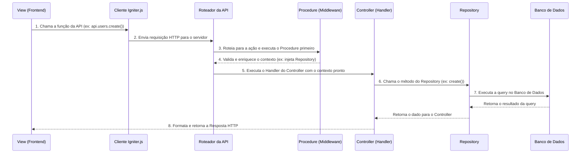

# Guia da Arquitetura do Projeto

Bem-vindo(a) ao guia da arquitetura do nosso projeto! Este documento foi criado para que qualquer pessoa desenvolvedora, mesmo sem nunca ter visto o projeto, possa entender rapidamente como ele funciona, desde seus princípios fundamentais até o fluxo de uma requisição.

A stack principal é composta por:
- **Next.js (React)**: Para o frontend e a estrutura do servidor.
- **Igniter.js**: Para a camada de API backend, garantindo organização e tipagem.
- **Prisma**: Como ORM (Object-Relational Mapper) para interagir com o banco de dados.
- **TypeScript & Zod**: Para garantir tipagem segura de ponta a ponta.

## Princípios Fundamentais

A arquitetura se baseia em alguns conceitos essenciais que garantem um código limpo, escalável e de fácil manutenção.

1.  **Arquitetura Baseada em Features (Feature-Based)**: O código do backend é organizado por funcionalidade (ex: `auth`, `organization`, `member`), não por tipo de arquivo. Isso torna mais fácil encontrar tudo o que está relacionado a uma parte específica do sistema.
2.  **Separação de Responsabilidades (SoC)**: Cada camada tem um papel bem definido e não interfere no papel da outra.
    -   **Controller**: Orquestra o fluxo.
    -   **Procedure**: Cuida da preparação e validação.
    -   **Repository**: Cuida do acesso aos dados.
3.  **Injeção de Dependência (DI)**: Em vez de um controller criar suas próprias dependências (como uma conexão com o banco de dados), elas são "injetadas" nele através do `context`. Isso torna o código mais testável e desacoplado.
4.  **Tipagem Segura de Ponta a Ponta (End-to-End Type-Safety)**: Desde o formulário no frontend até a coluna no banco de dados, os dados são validados e tipados, prevenindo uma classe inteira de bugs.

## Estrutura de Diretórios Essencial

- **/src/app**: Contém as páginas e layouts do Next.js (a parte visual que o usuário vê).
- **/src/features**: O coração da API. Cada subdiretório é uma "feature" (ex: `auth`, `member`) e contém seus próprios `controllers`, `procedures`, e `repositories`.
- **/src/services**: Serviços globais reutilizáveis (ex: conexão com banco de dados, serviço de hash de senha).
- **/src/igniter.router.ts**: O mapa principal da nossa API, que une todos os controllers para formar a API completa.

## O Fluxo de uma Requisição: Passo a Passo

Para entender a arquitetura, vamos seguir o caminho que uma requisição faz desde o clique do usuário até a resposta do banco de dados.

#### 1. A View (Frontend - React/Next.js)
Tudo começa aqui. Um componente React precisa de dados ou quer enviar dados. Ele usa o **Cliente Igniter.js** (`src/igniter.client.ts`), que oferece hooks e funções type-safe.
- **Exemplo**: `api.organization.create.useMutation()`

#### 2. O Cliente Igniter.js (A Ponte Inteligente)
Este cliente transforma a chamada da View em uma requisição HTTP (`POST`, `GET`, etc.) e a envia para o endpoint correto no backend (ex: `/api/v1/organization`).

#### 3. O Roteador da API (`igniter.router.ts`)
O roteador é o primeiro a receber a requisição no backend. Ele funciona como um mapa que diz: "Requisições para `/organization` devem ser tratadas pelo `organizationController`".

#### 4. Os Procedures (Middleware / "Porteiros")  <-- Ponto Crucial!
Antes de executar a lógica principal do controller, a requisição passa por um ou mais **Procedures**. Eles são como "porteiros" ou uma camada de preparação.
- **Autenticação**: O `authProcedure` verifica se o usuário está logado. Se não estiver (e a rota for protegida), ele barra a requisição aqui.
- **Injeção de Dependência**: O `organizationProcedure` cria uma instância do `OrganizationRepository` e a "injeta" no `context` da requisição.

#### 5. O Controller (O Orquestrador)
Com a requisição validada e o contexto preparado pelo procedure, o **Handler do Controller** finalmente é executado.
- Ele **não** fala com o banco de dados diretamente.
- Ele pega os dados da requisição (ex: `request.body`).
- Ele usa o repositório que foi injetado no contexto para executar a ação desejada.
    - **Exemplo**: `await context.organization.repository.create(...)`

#### 6. O Repository (O Executor de Dados)
Esta é a **única camada que tem permissão para falar com o banco de dados**.
- Ele contém métodos claros e diretos como `create`, `findById`, `update`, etc.
- Ele usa o **Prisma** para escrever as queries de forma segura.
- Isso isola toda a lógica de banco de dados em um só lugar.

#### 7. O Banco de Dados (A Fonte da Verdade)
O Prisma envia a query para o banco de dados, que executa a operação e retorna o resultado.

#### 8. A Resposta (O Caminho de Volta)
O resultado volta pela mesma cadeia: do Repository para o Controller, que então usa o objeto `response` para montar a resposta HTTP final (ex: `response.created(newOrganization)`) e a envia de volta para a View.

## Conceitos-Chave Detalhados

### O Contexto: A "Mochila" da Requisição
Imagine que cada requisição carrega uma "mochila" chamada `context`. No início, ela contém apenas serviços globais (como o `database`). Conforme passa pelos `procedures`, eles adicionam "ferramentas" a essa mochila (como o `auth.user` e o `organization.repository`). Quando chega no controller, ele simplesmente pega a ferramenta que precisa da mochila para trabalhar.

### Interfaces e Zod: O Contrato dos Dados
Para garantir que a View, o Controller e o Banco de Dados "falem a mesma língua", usamos os arquivos `*.interfaces.ts`.
- **Zod Schemas**: Definem a "forma" exata que um dado deve ter (ex: `name` deve ser uma `string` com no mínimo 3 caracteres). Isso é usado para validar automaticamente os dados que chegam na API.
- **TypeScript Types**: A partir dos esquemas Zod, o TypeScript infere os tipos, garantindo que você não tente acessar uma propriedade que não existe, por exemplo.

## Conclusão

Esta arquitetura, embora pareça ter muitas camadas, promove um desenvolvimento extremamente organizado, seguro e escalável. Cada parte tem sua responsabilidade, e a comunicação entre elas é clara e type-safe. Uma vez que você entende o fluxo `Procedure -> Controller -> Repository`, o desenvolvimento de novas features se torna muito mais rápido e menos propenso a erros.
